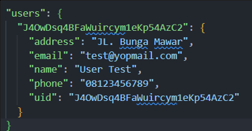
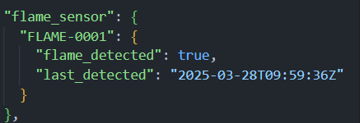
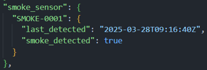
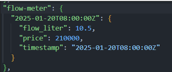
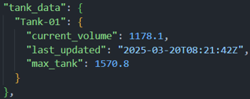
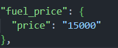
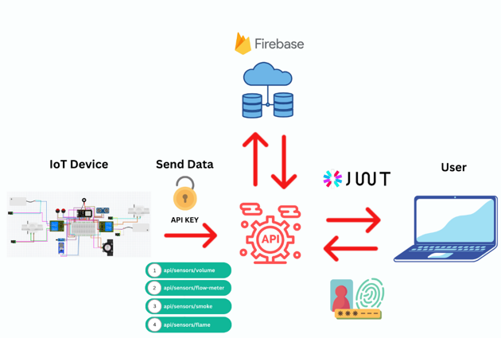

# API Fuel Tank IoT

This code for API Fuel Tank IoT Project.

## API Specs?

-   To view the API Specs open the docs folder and copy api_specs.yml
-   Open : https://editor.swagger.io/
-   And Then Paste code

## Database Structure?

-   Structure Data User

    

-   Structure Data Flame Sensor

    

-   Structure Data Smoke Sensor

    

-   Structure Data Flow Sensor
    

-   Structure Data Tank Data
    

-   Structure Data Fuel Price

    

## System Flow?

<h2 align="left">Technology Used?</h2>

###

  
   
   

###
